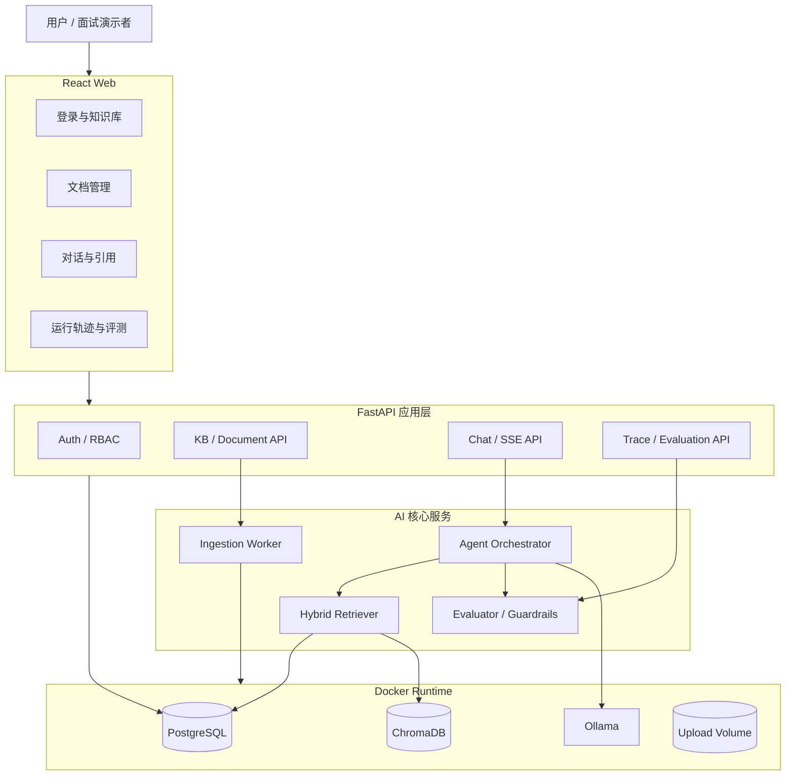
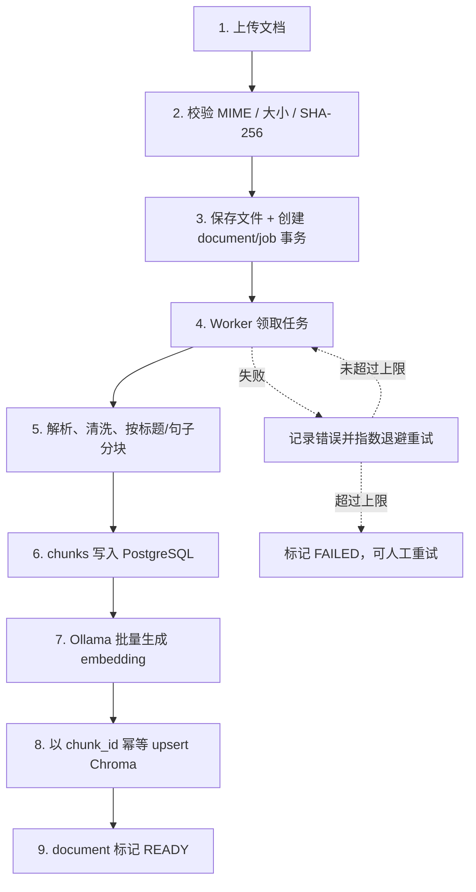
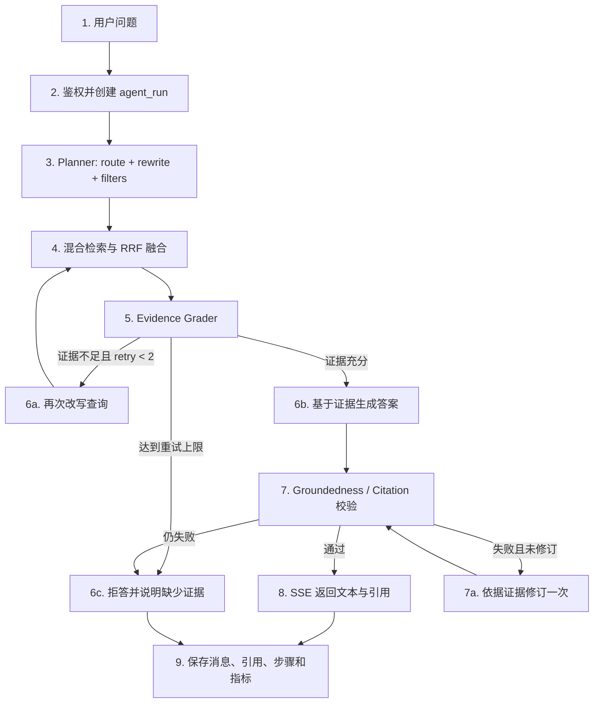
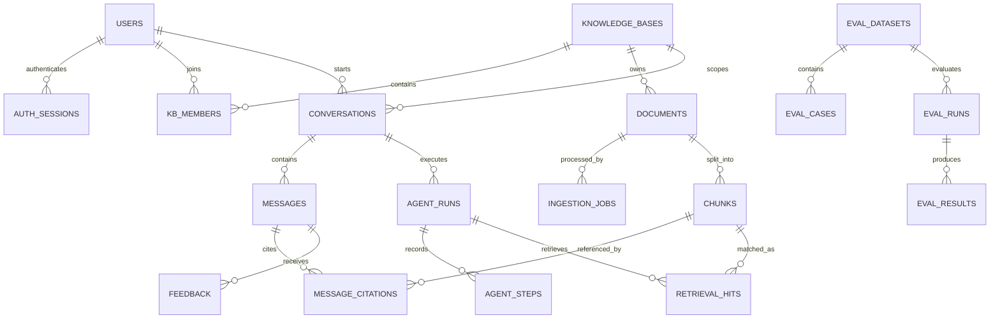

# Agentic RAG Platform — 系统架构设计

> 状态：Proposed v0.1  
> 阶段：Phase 1 — Architecture  
> 技术栈：React + TypeScript、FastAPI、PostgreSQL、ChromaDB、Docker、Ollama  
> 目标：构建一个可复现、可评测、可观测、可本地部署的企业知识库 Agentic RAG 平台。

> 实现说明：本文描述目标架构，不代表这些模块已经落地。当前代码状态为 Phase 3 Backend Foundation，仅实现 FastAPI/PostgreSQL 基础设施和 `GET /api/v1/health`；Worker、ChromaDB/Ollama 调用、RAG、Agent 与业务 API 均未实现。默认 Compose 只启动 `postgres` 和 `api`。

## 1. 项目定位与范围

### 1.1 一句话定义

用户上传私有文档后，系统通过一个**有边界的 Agent 工作流**完成问题路由、查询改写、混合检索、证据判断、带引用回答和答案核验，并保留可审计的结构化运行轨迹。

### 1.2 为什么它不是普通“Chat with PDF”

- Agent 根据问题与证据质量决定是否改写查询和再次检索，而不是固定执行一次向量搜索。
- 检索同时使用 ChromaDB 向量召回和 PostgreSQL 全文召回，再通过 RRF 融合。
- 回答必须引用具体文档、页码和 chunk；证据不足时明确拒答。
- 每次运行记录步骤、候选文档、分数、耗时、模型与 prompt 版本，支持问题复盘。
- 内置离线评测集，量化 Recall@K、MRR、引用正确率、忠实度和延迟。
- Ollama 在本地完成生成、结构化输出和 embedding，默认不向外部模型服务发送文档。

### 1.3 MVP 范围

包含：

- 用户注册、登录与知识库成员权限。
- 创建知识库，上传 PDF、Markdown、TXT 文档。
- 文档解析、分块、去重、索引、失败重试和重建索引。
- 多轮对话、SSE 流式回答、来源引用。
- Agent 结构化轨迹、用户反馈、离线评测面板。
- Docker Compose 一键启动，GitHub Actions 完成测试、镜像构建与发布。

暂不包含：

- 联网搜索、OCR、图片/音视频 RAG、多人协同编辑。
- 无限制 autonomous agent 或复杂多 Agent 编排。
- Kubernetes、多机 Chroma 集群和公有云对象存储。

这些内容可以作为后续增强项，但不进入第一版，防止项目范围失控。

### 1.4 验收目标

以下是目标值，不应在简历中写成已完成指标，必须在阶段 7 实测后再替换：

| 维度 | MVP 目标 |
| --- | --- |
| 检索 | 自建不少于 50 条测试问题；Recall@5 ≥ 0.80，MRR@10 ≥ 0.70 |
| 回答 | 引用正确率 ≥ 0.90，groundedness ≥ 0.85 |
| 拒答 | 无证据问题的正确拒答率 ≥ 0.80 |
| API | 非 LLM 接口本地 p95 < 300 ms |
| 可靠性 | 索引任务可重试、可恢复；同一任务重复执行不产生重复 chunk |
| 测试 | 后端核心模块覆盖率 ≥ 80%；PR 必须通过单元、集成与前端构建检查 |
| 可复现 | 新用户只需 `.env`、拉取模型和 `docker compose up` 即可运行 |

## 2. 总体架构原则

1. **PostgreSQL 是唯一事实源**：用户、文档、原文 chunk、会话、轨迹和评测均以 PostgreSQL 为准。
2. **ChromaDB 是可重建索引**：只存向量、检索元数据及与 PostgreSQL 相同的 `chunk_id`；丢失后可重建。
3. **模型通过适配器访问**：业务层依赖 `ChatModel` 与 `EmbeddingModel` 接口，不直接耦合 Ollama SDK。
4. **Agent 有明确边界**：有限状态机、最多两次检索、最多一次答案修订，避免循环失控。
5. **异步索引不依赖 Redis**：独立 worker 使用 PostgreSQL 任务表和 `FOR UPDATE SKIP LOCKED` 领取任务。
6. **API 契约优先**：FastAPI 输出 OpenAPI，前端 TypeScript client 由契约生成。
7. **默认可观测**：每个请求携带 `request_id`，每次 Agent 运行携带 `run_id`。
8. **不保存思维链**：只记录 route、工具调用、检索分数、判定标签、耗时等结构化结果。

## 3. 功能模块图



### 3.1 模块职责

| 模块 | 核心职责 | 关键输出 |
| --- | --- | --- |
| React Web | 认证、知识库、上传、聊天、引用侧栏、轨迹和评测页面 | 类型安全的 API 调用、SSE 增量渲染 |
| FastAPI API | 鉴权、输入校验、事务边界、OpenAPI、错误处理 | REST/SSE API、`request_id` |
| Ingestion Worker | 解析、规范化、分块、embedding、索引、重试 | PostgreSQL chunks、Chroma vectors |
| Agent Orchestrator | route、rewrite、retrieve、grade、generate、verify | 带引用答案、结构化运行轨迹 |
| Hybrid Retriever | dense + keyword 召回、过滤、RRF、重排 | Top-K 证据及完整分数 |
| Evaluator / Guardrails | 证据充分度、忠实度、离线指标、拒答 | 分数、失败原因、评测报告 |
| PostgreSQL | 业务数据、原始 chunk、全文索引、任务和轨迹 | 可审计的事实源 |
| ChromaDB | 语义向量和元数据过滤 | dense retrieval 候选 |
| Ollama | 本地 chat、结构化输出、embedding | 规划、评分、回答、向量 |
| Upload Volume | MVP 原始文件存储 | 可重建索引的源文件 |

### 3.2 Docker 服务划分

| Service | 镜像/进程 | 说明 |
| --- | --- | --- |
| `web` | React build + Nginx | 静态前端与 API 反向代理 |
| `api` | FastAPI/Uvicorn | REST、SSE、OpenAPI |
| `worker` | 与 api 共用 Python 镜像 | 独立消费 PostgreSQL ingestion jobs |
| `postgres` | PostgreSQL | 主数据、全文检索、任务队列 |
| `chroma` | Chroma server | 向量索引 |
| `ollama` | Ollama server | 本地模型推理；模型文件使用命名卷 |

API、worker、PostgreSQL、Chroma 和 Ollama 都定义 healthcheck；服务依赖以 `service_healthy` 为条件，而不是仅依赖容器启动顺序。

## 4. 数据流设计

### 4.1 文档索引流



关键规则：

- 上传接口只做校验和入队，成功返回 `202 Accepted`，避免大文件阻塞 HTTP 请求。
- `sha256` 用于同一知识库内去重；`chunk_id` 使用 UUID，重试时保持不变。
- 分块初始参数：约 450 tokens、80 tokens overlap，优先按标题、段落和句子边界切分。
- 中文文本先做应用层分词，英文做规范化，再写入 PostgreSQL `tsvector`，支持双语关键词检索。
- Chroma upsert 完成前，文档不能进入 `READY`；查询只检索 READY 文档。
- 删除与重建同样进入 job，保证 PostgreSQL 与 Chroma 最终一致。

### 4.2 Agent 问答流



#### Planner 的结构化输出

Ollama 输出必须通过 JSON Schema 校验，例如：

```json
{
  "route": "retrieve",
  "rewritten_queries": ["..."],
  "filters": {"document_ids": [], "tags": []},
  "top_k": 8,
  "reason_code": "KNOWLEDGE_QUESTION"
}
```

只保存 `reason_code` 等可审计字段，不保存模型的隐藏推理过程。

#### 混合检索算法

1. 对改写后的查询调用 Ollama embedding。
2. ChromaDB 按 `kb_id`/文档过滤，召回 dense Top-20。
3. PostgreSQL `tsvector + GIN` 召回 keyword Top-20。
4. 使用 Reciprocal Rank Fusion：`score(d) = Σ 1 / (k + rank_i(d))`，默认 `k=60`。
5. 对融合后的 Top-12 做相关性重排，保留 Top-6～8 作为上下文。
6. Evidence Grader 判断覆盖度、冲突与证据是否足够。
7. 所有候选及 dense、keyword、RRF、rerank 分数写入 `retrieval_hits`。

第一版重排器使用可替换接口：默认由本地模型输出结构化 relevance score；后续可无侵入替换为本地 cross-encoder。

## 5. 数据库设计

### 5.1 数据关系



### 5.2 表结构

所有主键均使用 UUID；时间使用 `TIMESTAMPTZ`；软删除对象包含 `deleted_at`。

| 表 | 关键字段 | 说明与关键约束 |
| --- | --- | --- |
| `users` | `id`, `email`, `password_hash`, `display_name`, `status` | `email` 唯一；密码只存 Argon2 hash |
| `auth_sessions` | `id`, `user_id`, `refresh_token_hash`, `expires_at`, `revoked_at`, `user_agent` | refresh token 只存 hash；支持单设备登出与全部撤销 |
| `knowledge_bases` | `id`, `name`, `description`, `owner_id`, `embedding_model`, `chroma_collection`, `index_version` | 一个 KB 固定一个 embedding 模型与索引版本 |
| `kb_members` | `kb_id`, `user_id`, `role` | 复合主键；role=`owner/editor/viewer` |
| `documents` | `id`, `kb_id`, `filename`, `storage_path`, `mime_type`, `size_bytes`, `sha256`, `status`, `chunk_count`, `error_message` | `UNIQUE(kb_id, sha256)`；status=`pending/processing/ready/failed/deleting` |
| `ingestion_jobs` | `id`, `document_id`, `job_type`, `status`, `stage`, `progress`, `attempts`, `max_attempts`, `next_attempt_at`, `locked_at`, `error` | worker 使用行锁领取；为 `(status,next_attempt_at)` 建索引 |
| `chunks` | `id`, `document_id`, `ordinal`, `content`, `token_count`, `page_number`, `section`, `metadata JSONB`, `search_text`, `search_vector`, `content_hash` | `UNIQUE(document_id, ordinal)`；`search_vector` 使用 GIN |
| `conversations` | `id`, `kb_id`, `user_id`, `title`, `last_message_at` | 会话始终绑定一个 KB |
| `messages` | `id`, `conversation_id`, `role`, `content`, `status`, `agent_run_id`, `created_at` | role=`user/assistant/system`；流中断可记录 failed |
| `message_citations` | `id`, `message_id`, `chunk_id`, `display_order`, `quote`, `page_number` | 保存回答实际采用的证据，不只保存检索候选 |
| `agent_runs` | `id`, `conversation_id`, `query_message_id`, `answer_message_id`, `status`, `route`, `model`, `prompt_version`, `latency_ms`, `input_tokens`, `output_tokens`, `groundedness`, `error_code` | 一次用户问题对应一个 run |
| `agent_steps` | `id`, `run_id`, `step_no`, `step_type`, `input_json`, `output_json`, `status`, `duration_ms` | `UNIQUE(run_id, step_no)`；保存结构化轨迹 |
| `retrieval_hits` | `id`, `run_id`, `step_id`, `chunk_id`, `dense_rank`, `keyword_rank`, `rrf_score`, `rerank_score`, `selected` | 支持检索效果和错误案例分析 |
| `feedback` | `id`, `message_id`, `user_id`, `rating`, `reason`, `comment` | `UNIQUE(message_id,user_id)`；rating=`up/down` |
| `eval_datasets` | `id`, `name`, `version`, `description` | 评测集必须版本化 |
| `eval_cases` | `id`, `dataset_id`, `question`, `expected_answer`, `expected_chunk_ids`, `should_abstain`, `tags JSONB` | ground truth；允许答案为空但要求拒答 |
| `eval_runs` | `id`, `dataset_id`, `config_snapshot JSONB`, `status`, `started_at`, `finished_at` | 固化模型、prompt、chunk 和检索参数 |
| `eval_results` | `id`, `eval_run_id`, `eval_case_id`, `answer`, `retrieved_chunk_ids`, `metrics JSONB`, `latency_ms`, `error` | 每个 case 的完整结果和指标 |

建议索引：

- `chunks USING GIN(search_vector)`；`chunks(document_id, ordinal)`。
- `documents(kb_id, status, created_at DESC)`。
- `ingestion_jobs(status, next_attempt_at)`，并对未完成任务建立 partial index。
- `messages(conversation_id, created_at)`。
- `agent_runs(conversation_id, created_at DESC)`。
- `agent_steps(run_id, step_no)`、`retrieval_hits(run_id, selected)`。

### 5.3 ChromaDB 数据模型

- 每个知识库一个 collection：`kb_<uuid>_v<index_version>`。
- Chroma record id 与 PostgreSQL `chunks.id` 完全一致。
- document 字段：chunk 正文。
- embedding：由 `OLLAMA_EMBED_MODEL` 生成。
- metadata：`kb_id`、`document_id`、`page_number`、`ordinal`、`content_hash`、`index_version`。
- 任何授权判断都先在 FastAPI 完成，绝不接受客户端直接传 collection 名称。
- 删除 Chroma 后可从 `documents + chunks` 全量重建；因此 Chroma 不是事实源。

## 6. API 设计

### 6.1 通用约定

- Base URL：`/api/v1`。
- 鉴权：短期 access token + 可撤销 refresh session；`Authorization: Bearer <token>`。
- ID：UUID 字符串；时间：ISO 8601 UTC。
- 分页：列表统一 `cursor` + `limit`，响应返回 `next_cursor`。
- 上传与异步任务返回 `202 Accepted`。
- 写请求支持 `Idempotency-Key`，防止重复上传或重复发问。
- 每个响应返回 `X-Request-ID`；错误采用统一 envelope。
- 前端 client 从 FastAPI OpenAPI 自动生成，避免手写重复类型。

统一错误示例：

```json
{
  "error": {
    "code": "DOCUMENT_NOT_READY",
    "message": "The document is still being indexed.",
    "details": {},
    "request_id": "req_..."
  }
}
```

### 6.2 端点清单

| 模块 | Method | Endpoint | 作用 |
| --- | --- | --- | --- |
| Auth | POST | `/auth/register` | 注册 |
| Auth | POST | `/auth/login` | 登录并返回 token |
| Auth | POST | `/auth/refresh` | 刷新 access token |
| Auth | POST | `/auth/logout` | 撤销当前 session |
| Auth | GET | `/users/me` | 当前用户信息 |
| KB | POST | `/knowledge-bases` | 创建知识库 |
| KB | GET | `/knowledge-bases` | 获取有权访问的 KB |
| KB | GET | `/knowledge-bases/{kb_id}` | KB 详情与索引状态 |
| KB | PATCH | `/knowledge-bases/{kb_id}` | 修改名称、描述 |
| KB | DELETE | `/knowledge-bases/{kb_id}` | 异步删除 KB 与索引 |
| KB | PUT | `/knowledge-bases/{kb_id}/members/{user_id}` | 添加或修改成员权限 |
| Document | POST | `/knowledge-bases/{kb_id}/documents` | multipart 上传；返回 document/job |
| Document | GET | `/knowledge-bases/{kb_id}/documents` | 文档列表与状态 |
| Document | GET | `/documents/{document_id}` | 文档详情、错误、chunk 数 |
| Document | DELETE | `/documents/{document_id}` | 异步删除文件与索引 |
| Document | POST | `/documents/{document_id}/reindex` | 重建索引 |
| Job | GET | `/jobs/{job_id}` | 查询进度和错误 |
| Conversation | POST | `/conversations` | 创建 KB 会话 |
| Conversation | GET | `/conversations` | 当前用户会话列表 |
| Conversation | GET | `/conversations/{id}/messages` | 分页获取消息 |
| Conversation | PATCH | `/conversations/{id}` | 修改标题 |
| Conversation | DELETE | `/conversations/{id}` | 删除会话 |
| Chat | POST | `/chat` | 非流式问答；便于 SDK 与集成测试 |
| Chat | POST | `/chat/stream` | SSE 流式问答 |
| Trace | GET | `/runs/{run_id}` | 运行概要和质量分数 |
| Trace | GET | `/runs/{run_id}/trace` | 步骤、检索候选、耗时与错误 |
| Feedback | PUT | `/messages/{message_id}/feedback` | 点赞/点踩与原因 |
| Eval | POST | `/eval/datasets` | 创建版本化评测集 |
| Eval | POST | `/eval/datasets/{id}/cases` | 添加测试问题 |
| Eval | POST | `/eval/runs` | 异步执行评测 |
| Eval | GET | `/eval/runs/{id}` | 评测进度和汇总指标 |
| Eval | GET | `/eval/runs/{id}/results` | case 级错误分析 |
| Ops | GET | `/api/v1/health` | 当前已实现：服务与 PostgreSQL readiness 检查 |
| Ops | GET | `/api/v1/health/ready` | 未来契约：PG/Chroma/Ollama 依赖就绪检查 |
| Ops | GET | `/metrics` | 请求、检索、模型和任务指标 |

### 6.3 核心聊天契约

`POST /api/v1/chat/stream`

```json
{
  "conversation_id": "uuid",
  "knowledge_base_id": "uuid",
  "message": "退款政策是什么？",
  "filters": {
    "document_ids": [],
    "tags": []
  },
  "debug": false
}
```

SSE event 顺序：

| Event | 数据 |
| --- | --- |
| `run.started` | `run_id`, `request_id` |
| `agent.status` | 当前公开阶段，如 `retrieving`、`verifying` |
| `retrieval.sources` | 已选择来源的标题、页码与 chunk id |
| `message.delta` | 增量文本 |
| `message.citation` | 引用编号与来源 |
| `run.completed` | message id、耗时、质量分数 |
| `error` | 稳定错误码、可重试标记 |

SSE 断开时服务端取消生成或将 run 标为 `cancelled`；重连不续传旧 token，客户端通过 `run_id` 读取最终状态。

## 7. GitHub 目录结构

采用单仓库 monorepo，前后端独立构建，共享 API 契约：

```text
agentic-rag-platform/
├── .github/
│   ├── ISSUE_TEMPLATE/
│   ├── pull_request_template.md
│   └── workflows/
│       ├── ci.yml
│       ├── security.yml
│       └── release.yml
├── apps/
│   ├── web/
│   │   ├── src/
│   │   │   ├── api/
│   │   │   ├── components/
│   │   │   ├── features/
│   │   │   │   ├── auth/
│   │   │   │   ├── knowledge-base/
│   │   │   │   ├── documents/
│   │   │   │   ├── chat/
│   │   │   │   └── evaluation/
│   │   │   ├── hooks/
│   │   │   ├── pages/
│   │   │   ├── routes/
│   │   │   ├── stores/
│   │   │   └── test/
│   │   ├── e2e/
│   │   ├── Dockerfile
│   │   ├── package.json
│   │   └── vite.config.ts
│   └── api/
│       ├── app/
│       │   ├── api/v1/endpoints/
│       │   ├── agent/
│       │   │   ├── nodes/
│       │   │   ├── prompts/
│       │   │   ├── tools/
│       │   │   └── workflow.py
│       │   ├── core/
│       │   ├── db/
│       │   │   ├── models/
│       │   │   ├── repositories/
│       │   │   └── session.py
│       │   ├── ingestion/
│       │   ├── llm/
│       │   ├── retrieval/
│       │   ├── evaluation/
│       │   ├── observability/
│       │   ├── schemas/
│       │   ├── services/
│       │   ├── workers/
│       │   └── main.py
│       ├── alembic/
│       ├── tests/
│       │   ├── unit/
│       │   ├── integration/
│       │   ├── contract/
│       │   └── fixtures/
│       ├── Dockerfile
│       └── pyproject.toml
├── packages/
│   └── api-client/              # OpenAPI 生成的 TypeScript client
├── eval/
│   ├── datasets/
│   ├── reports/
│   └── README.md
├── docs/
│   ├── architecture.md
│   ├── api.md
│   ├── evaluation.md
│   ├── deployment.md
│   └── adr/
│       ├── 001-postgres-source-of-truth.md
│       ├── 002-bounded-agent-workflow.md
│       └── 003-postgres-job-queue.md
├── infra/
│   ├── nginx/
│   └── scripts/
├── scripts/
│   ├── bootstrap.sh
│   ├── pull_models.sh
│   └── seed_demo.py
├── sample-data/
├── compose.yaml
├── compose.test.yaml
├── Makefile
├── .env.example
├── .gitignore
├── .pre-commit-config.yaml
├── CONTRIBUTING.md
├── LICENSE
├── README.md
└── SECURITY.md
```

目录原则：

- endpoint 只负责 HTTP；业务进入 service；数据库操作进入 repository。
- `agent/` 只编排状态，不直接写 SQL 或调用 SDK。
- `llm/` 提供 Ollama adapter 和 CI 使用的 fake adapter。
- `retrieval/` 的 dense、keyword、fusion、rerank 均为独立可测组件。
- worker 与 API 共用应用代码和镜像，仅 entrypoint 不同。
- 不提交上传文件、Chroma 数据、PostgreSQL volume、Ollama 模型或 `.env`。

## 8. 开发计划

建议周期：8 周，每周约 12～18 小时。每周必须留下可运行代码、测试和可演示成果，避免最后一周集中补文档。

| 周 | 主题 | 主要任务 | 周验收标准 |
| --- | --- | --- | --- |
| 第 1 周 | 架构与工程骨架 | 冻结本文；创建 monorepo；React/FastAPI 最小应用；Compose 启动 PG/Chroma/Ollama；lint/typecheck/pre-commit；写 3 个 ADR | `docker compose up` 后 web、API 和依赖 healthcheck 全绿 |
| 第 2 周 | 数据层与权限 | SQLAlchemy/Alembic；users、KB、members、documents、jobs；JWT/session；RBAC；上传接口与文件校验 | migration 可升降级；viewer/editor 越权测试通过；上传返回 202/job id |
| 第 3 周 | 文档摄取 | worker 任务领取；PDF/MD/TXT parser；清洗、分块、token 统计；Ollama embedding；Chroma 幂等写入；失败重试/重建 | 样例 PDF 能从 PENDING 到 READY；重复执行不产生重复 chunk；故障恢复测试通过 |
| 第 4 周 | 检索基线 | Chroma dense；PostgreSQL 双语 keyword；metadata filter；RRF；检索 debug API；制作首批 30～50 条检索测试集 | 输出 Recall@K、MRR、延迟基线；每个结果可追踪 dense/keyword/RRF 分数 |
| 第 5 周 | Agent 工作流 | planner、rewrite、evidence grader、generator、verifier；有限状态机；拒答；结构化 trace；普通 JSON 与 SSE 接口 | 有证据、证据不足、冲突证据三类用例通过；不会无限循环；答案引用可定位到页码 |
| 第 6 周 | React 产品化 | 登录、KB/文档状态、聊天、流式文本、引用侧栏、trace 时间线、反馈、基础评测页面；响应式布局与错误状态 | 用户可从上传文档到问答完整走通；刷新页面后会话仍存在；Playwright 主路径通过 |
| 第 7 周 | 质量与评测 | 单元/集成/契约/E2E；fake Ollama；50+ golden cases；groundedness/citation/no-answer 指标；性能与安全测试；prompt injection 防护 | 后端核心覆盖率 ≥80%；评测报告可复现；失败案例能从 trace 定位原因 |
| 第 8 周 | CI/CD 与作品包装 | GitHub Actions；Docker 多阶段构建；依赖与镜像扫描；发布 GHCR；release tag；README、架构图、API 示例、演示 GIF/视频、简历 bullet | 空白机器按 README 可启动；PR 检查全绿；tag 自动发布镜像；简历只使用实测数据 |

### 8.1 阶段里程碑

- **M1（第 3 周）**：可上传、可索引、可恢复。
- **M2（第 5 周）**：可 Agentic 问答、可引用、可拒答、可追踪。
- **M3（第 7 周）**：可量化效果、测试可信。
- **M4（第 8 周）**：GitHub 项目可复现、可展示、可写入简历。

## 9. 已冻结的架构决策

| ADR | 决策 | 原因 |
| --- | --- | --- |
| ADR-001 | PostgreSQL 为事实源，Chroma 为可重建索引 | 避免双主数据和一致性不清 |
| ADR-002 | PostgreSQL FTS + Chroma dense + RRF | 同时覆盖关键词、专有名词和语义表达 |
| ADR-003 | 有限状态机，不采用无限自主循环 | 行为可测、成本和延迟可控 |
| ADR-004 | SSE 而非 WebSocket | 当前仅需服务端单向 token 流，部署更简单 |
| ADR-005 | PostgreSQL job queue，不引入 Redis/Celery | 控制 MVP 依赖数量，同时保留独立 worker 与可靠重试 |
| ADR-006 | 模型与 embedding 均通过 adapter | 可切换 Ollama 模型，并能在 CI 中使用 fake model |
| ADR-007 | 每个 KB 一个 Chroma collection | 便于隔离、删除、重建和固定 embedding 版本 |

## 10. 默认模型与配置策略

- `OLLAMA_CHAT_MODEL=qwen3:4b-instruct`：优先保证普通开发机能运行；硬件允许时可改为 `qwen3:8b`。
- `OLLAMA_EMBED_MODEL=qwen3-embedding:0.6b`：中英文 embedding 的本地默认选择。
- 模型名、temperature、context window、prompt version、chunk 参数和检索参数都进入配置，并写入 `eval_runs.config_snapshot`。
- CI 不下载真实模型，使用固定输出的 fake chat/embedding adapter；真实模型只在 nightly/manual evaluation 中运行。

## 11. 官方依据

- Ollama 支持 tool calling、JSON Schema structured outputs、streaming 和本地 embeddings：<https://docs.ollama.com/capabilities/tool-calling>、<https://docs.ollama.com/capabilities/structured-outputs>、<https://docs.ollama.com/capabilities/streaming>、<https://docs.ollama.com/capabilities/embeddings>。
- Chroma collection 的记录由 id、embedding、metadata 和 document 组成，并支持 metadata/full-text filtering：<https://docs.trychroma.com/reference/architecture/overview>、<https://docs.trychroma.com/docs/querying-collections/metadata-filtering>。
- PostgreSQL 推荐使用 GIN 加速 `tsvector` 全文检索：<https://www.postgresql.org/docs/current/textsearch-indexes.html>。
- FastAPI 基于 OpenAPI/JSON Schema 提供自动接口文档，并支持依赖覆盖进行测试：<https://fastapi.tiangolo.com/features/>、<https://fastapi.tiangolo.com/advanced/testing-dependencies/>。
- Docker Compose 可以结合 healthcheck 和 `depends_on.condition: service_healthy` 管理服务就绪顺序：<https://docs.docker.com/compose/how-tos/startup-order/>。
- GitHub Actions 官方支持 Python、Node.js 测试及 Docker 镜像发布：<https://docs.github.com/actions/guides/building-and-testing-python>、<https://docs.github.com/actions/guides/building-and-testing-nodejs>、<https://docs.github.com/actions/guides/publishing-docker-images>。

## 12. Phase 1 完成定义

- 功能模块、数据流、数据库、API、目录和 8 周计划均已冻结为 v0.1。
- 下一阶段只建立工程骨架和开发环境，不提前实现完整 RAG。
- 若实现中发现需求冲突，通过 ADR 修改，并同步更新本文件，避免代码与文档分离。
