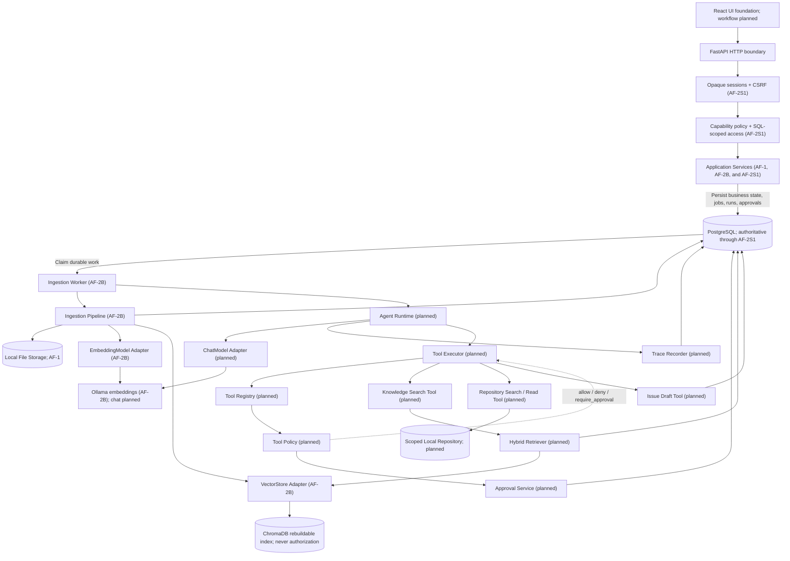
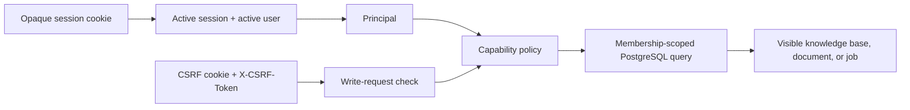
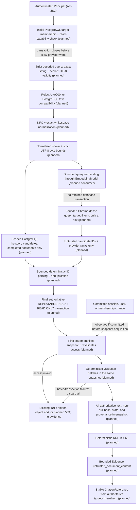

# AgentForge architecture

## Current implementation status

The Phase 3 foundation, AF-1 knowledge intake, AF-2 durable ingestion and
indexing through AF-2B, and the minimal AF-2S1 knowledge-access boundary are
implemented:

- FastAPI application factory and lifecycle;
- typed configuration;
- asynchronous PostgreSQL engine and session infrastructure;
- versioned API routing, health/readiness behavior, and unified errors;
- structured logging and request correlation;
- React/Vite application foundation;
- Docker Compose and CI foundations.
- durable `KnowledgeBase`, `Document`, and `IngestionJob` PostgreSQL records;
- secure local PDF, Markdown and text intake with streamed hashing;
- database-enforced per-knowledge-base deduplication;
- idempotent retry transitions for failed ingestion jobs;
- bounded attempt, progress, claim, lease, and retry-scheduling job metadata;
- text, Markdown, and extractable-text PDF parsers;
- deterministic normalization and overlapping chunk production;
- PostgreSQL-authoritative `DocumentChunk` records with ordering, hashes, and
  source provenance;
- short-transaction job claiming, retry scheduling, and expired-lease recovery;
- Ollama embedding and Chroma vector-store adapters behind provider-neutral
  boundaries;
- idempotent document and knowledge-base vector-index rebuilds;
- operator-provisioned local users with Argon2id password hashes;
- opaque, expiring, revocable server-side sessions with session-bound CSRF
  protection;
- owner/editor/viewer knowledge-base memberships and capability-based policy;
- principal-scoped SQL access to knowledge bases, documents, and ingestion
  jobs;
- fail-closed handling and explicit operator claiming for unowned legacy
  knowledge bases.

Health and readiness remain public. AF-2S1 adds only `login`, `logout`, and
`me` authentication endpoints; every knowledge endpoint now requires a valid
principal, and authenticated writes require CSRF proof. AF-2B adds an
out-of-process worker and rebuild commands rather than retrieval endpoints.
Retrieval, agent, tool, approval, trace, and evaluation capabilities are
planned and unimplemented. Broader AF-2S2 identity and operational hardening
is deferred to P1.

## Architectural principles

- Keep a modular monolith and do not split microservices in P0.
- Keep PostgreSQL as the business source of truth.
- Treat ChromaDB as a rebuildable index.
- Authenticate every user-facing private-data request.
- Scope object authorization in PostgreSQL queries; never authorize from
  Chroma metadata.
- Maintain an explicit internal Agent Runtime boundary.
- Apply deterministic Tool Policy before every execution attempt.
- Require approval for write and external actions.
- Record a public structured trace without hidden chain-of-thought.
- Introduce adapters only with their first consumers.
- Use deterministic fake adapters for ordinary tests.
- Do not use LangGraph in P0.
- Do not use MCP in P0.

## Target module architecture

The diagram is implemented through the AF-2S1 access boundary and AF-2B
ingestion path. Runtime, tool, retrieval, trace, and model-chat nodes remain
planned. Arrows show permitted dependency direction; they do not imply that
every persistence operation is strictly sequential:



Application Services persist durable work but never invoke worker processes.
The AF-2B Worker claims eligible ingestion work from PostgreSQL and invokes the
Ingestion Pipeline. A future worker path into the Agent Runtime remains planned.

The health endpoint bypasses the authenticated flow shown above. Worker and
operator commands use explicitly internal persistence operations; they do not
fabricate an HTTP principal or reuse user-scoped repositories.

The only legal planned tool invocation path is `Agent Runtime → Tool Executor →
Tool Registry → Tool Policy`. The registry owns tool identity, version, input
schema, and risk classification. Policy returns `allow`, `deny`, or
`require_approval`. An allowed Tool Executor dispatches only the resolved
native tool through its permitted application port.

Approval decisions are persisted through the Approval Service. Approval
endpoints and the Approval Service never execute tools. After approval, the
Worker resumes the Agent Runtime, which returns through the Tool Executor. The
executor re-resolves the tool, revalidates canonical arguments, and re-runs
policy before execution.

MCP remains outside P0. Future P1 MCP tools must enter through an MCP adapter
behind the same internal Tool Registry and Tool Executor path; MCP cannot
create a second execution or policy path.

## Ingestion flow

AF-1 implements upload validation, local storage, and durable document/job
records. AF-2A added lease/retry fields and the authoritative chunk table.
AF-2B implements the rest of this ingestion flow:

```mermaid
flowchart LR
    Upload["Upload (AF-1)"] --> Validate["Validate (AF-1)"]
    Validate --> Storage["Local storage (AF-1)"]
    Storage --> Records["PostgreSQL Document + IngestionJob (AF-1)"]
    Records --> Claim["Claim with bounded lease (AF-2B)"]
    Claim --> Parse["Parse managed artifact (AF-2B)"]
    Parse --> Normalize["Normalize deterministically (AF-2B)"]
    Normalize --> Chunk["Deterministic chunking (AF-2B)"]
    Chunk --> PGChunks["Transactional DocumentChunk replacement (AF-2B)"]
    PGChunks --> Embed["Embed in bounded batches (AF-2B)"]
    Embed --> Upsert["Idempotent Chroma upsert (AF-2B)"]
    Upsert --> Ready["Document and job completed (AF-2B)"]
```



PostgreSQL is authoritative. Chroma can be rebuilt from PostgreSQL-authoritative
records. A document and its job are not marked completed until durable chunk
persistence and derived-index updates both succeed. AF-2B does not expose
search or retrieval behavior.

### AF-2 persistence and execution model

The four AF-1 lifecycle values remain unchanged: `pending`, `processing`,
`completed`, and `failed`. `IngestionJob` reuses its existing attempt, failure,
start, and finish fields and adds:

- `max_attempts` and `progress_percent`;
- `claimed_by`, `claimed_at`, and `lease_expires_at`;
- `next_retry_at`.

Database checks keep attempts non-negative and within a positive maximum,
progress between 0 and 100, and claimant identifiers nonblank when present.
Claim identity and timestamps must be either all absent or all present, and a
lease must expire after it is claimed. The existing status/creation index
continues to provide queue ordering; status/retry and status/lease indexes
support scheduled-retry and expired-lease queries.

`DocumentChunk` has a cascading document association, a zero-based
`chunk_index`, normalized text, a non-negative token count, and the shared
timestamps. AF-2B adds a content SHA-256 plus optional character offsets and
PDF page ranges. The hash column remains nullable for preserved legacy rows,
and its database format when present is 64 lowercase hexadecimal characters.
Future AF-3 retrieval requires the persisted hash to be non-null and valid;
`completed` document status alone does not make a legacy null-hash chunk
retrievable or citable. AF-2B derives each new chunk UUID deterministically
from the document UUID, chunk index, and content hash, so unchanged
reprocessing preserves identity. Database constraints require non-negative
ordering, nonempty text, valid paired provenance ranges, and uniqueness of
`(document_id, chunk_index)`. Embeddings remain outside PostgreSQL because they
are regenerated data; stable Chroma IDs derive from durable chunk UUIDs.

Workers claim due jobs with `FOR UPDATE SKIP LOCKED` in a short transaction.
Parsing, embedding calls, and Chroma writes occur without holding that
transaction open. Failures retain bounded safe error data and either schedule a
retry or become terminal when the attempt limit is reached. Expired leases are
recovered to the same bounded retry lifecycle. Cancellation is propagated
after the worker releases its claim through a short state transition.

The rebuild workflow reads ordered chunks from PostgreSQL, regenerates
embeddings in bounded batches, and idempotently replaces only the vectors for
the requested document or knowledge base. Partial external failures are
reported; durable chunk content is not rolled back or inferred from Chroma.
Knowledge-base rebuilds report and skip non-completed documents instead of
deleting vectors from a stale status snapshot that could race active ingestion.

## Knowledge-access boundary

AF-2S1 establishes the minimum P0 boundary required before private-document
retrieval:



The raw session and CSRF tokens are returned only through cookies; PostgreSQL
stores their SHA-256 digests. Passwords use Argon2id hashes and are accepted
only by the operator bootstrap command and login endpoint. There is no public
registration or authentication bypass.

Login holds no database transaction or checked-out connection during Argon2
verification or rehash computation. One application-owned bounded executor
limits that work to `ARGON2_MAX_CONCURRENCY` jobs per process (two by default).
After successful verification, a short write transaction locks the user and
rechecks active state and the observed hash before an optional rehash update
and fresh session insert.

Any active user may create a knowledge base and becomes its owner in the same
transaction. Owners and editors may read, upload, and retry; viewers may read
but cannot upload or retry. Endpoints request capabilities rather than testing
role names.

User-facing reads incorporate membership into their SQL. An absent resource
and a resource owned by a non-member both return `404`; a visible resource for
a member lacking the requested capability returns `403`. Missing or invalid
sessions return `401`, while missing or invalid CSRF proof on an authenticated
write returns `403`.

The migration does not invent owners for existing data. Unowned legacy
knowledge bases are invisible to user-facing SQL but remain available to the
internal ingestion worker. An operator can explicitly and transactionally
claim only still-unowned knowledge bases for an existing local user.

Chroma contains derived text and vectors, not authority. Future AF-3 retrieval
must scope every candidate through PostgreSQL membership, document state, and
current chunk identity before returning it. A Chroma knowledge-base ID or
other metadata value can never grant access.

## Planned hybrid retrieval flow

AF-3 remains planned and unimplemented. ADR-008 defines the required design
boundary and `retrieval-security-acceptance.md` defines future executable
tests; neither document supplies runtime retrieval behavior.



Every request targets exactly one knowledge base. The initial PostgreSQL check
requires a live principal, current target membership, and the existing
knowledge-base read capability before embedding or Chroma work begins.
Keyword candidates are scoped in SQL by the same principal, target knowledge
base, read capability, completed-document state, and current chunk ownership;
global keyword search followed by Python filtering is not a legal path.

AF-3C has exactly two public operations: retrieval at
`POST /api/v1/knowledge-bases/{knowledge_base_id}/retrieval`, with exact JSON
fields `query` (required string) and `requested_count` (optional strict integer
default `10`); and citation resolution at
`POST /api/v1/knowledge-bases/{knowledge_base_id}/citations/resolve`, with the
sole required string field `citation_reference` containing the existing
`af3:citation:v1:<knowledge-base-UUID>:<chunk-UUID>:<content-sha256>`
structure. Both require a canonical lowercase UUID path, exact
`application/json`, no coercion/duplicate/extra/alias fields, and no alternate
endpoint or citation token.

Both POST bodies are incrementally bounded to exactly 65,536 application-body
octets exposed through ASGI before JSON decoding. Equality may proceed; byte
65,537 aborts immediately without unbounded `body()` materialization, JSON/
schema/semantic work, retrieval work, or final PostgreSQL work. Current
session/user authentication runs first, canonical target parsing and exact-
target authorization second, supported media third, then bounded collection,
strict JSON, closed schema, operation semantics, and retrieval or final
citation work. This preserves generic `401`, hidden `404`, and authorized-
caller `422`; unauthenticated/hidden requests do not process the body, and
unsupported media fails before body collection.

After closed-schema and exact-type validation, the exact decoded-query
pipeline is strict Unicode-scalar and strict UTF-8 validity; reject any U+0000
before NFC as validation, not normalization; apply NFC exactly once;
trim/collapse the explicit ADR-008 Unicode whitespace set to single interior
U+0020; validate normalized scalar bounds and then strict UTF-8 byte bounds;
then begin keyword and embedding work.
U+0000 is neither transformed nor sent to PostgreSQL. A literal unescaped NUL
inside a JSON string fails strict JSON parsing, while the valid ASCII escape
`"\u0000"` reaches the semantic gate. For an authenticated and initially
authorized escaped-U+0000 request, the gate produces generic
`422 VALIDATION_ERROR`, private/no-store, and no normalization work, keyword
statements, embedding calls, Chroma/Provider calls, or final transactions, and
it produces no Evidence. The normalized query has 1–2,048 Unicode scalar
values and 1–4,096 strict UTF-8 bytes. Requested results are 1–50. Dense
over-fetch factor is `4`; dense/Provider maximum is `128`; keyword maximum is
`128`; unique-union
maximum is `192`; and validation batch size is `64`. For public count `R`,
configured Provider count is `min(128, checked_multiply(R, 4))`; ADR-008 fixes
the raw-position, dense, keyword, union, validation-query, eligible, and final
`min(R, E)` relationships.

In particular, `R = 10` configures `C = 40`: exactly 40 raw Provider
positions may proceed, while 41 is fatal even though it is below the global
128 ceiling. The configured `C`, not only the global maximum, bounds every
response.

Embedding and Chroma are separate slow-external-work lifecycle boundaries.
At each boundary, all earlier request/initial database work is complete and
the request retains no PostgreSQL connection, transaction, Session, or
SessionTransaction; the final transaction has not begun. Embedding is exactly
one normalized-query call producing one configured-dimension finite vector.
Embedding failure is Provider-fatal with no keyword fallback, and controlled
request cancellation cannot retain a database resource or start Chroma/final
validation. Repository truth uses raw `httpx`,
pins `chromadb/chroma:1.5.9`, and has no Chroma SDK dependency. AF-3B's first
query consumer adds compatibility identifier `chroma-http-v2-1.5.9`, requires
exact version JSON `"1.5.9"` from `GET /api/v2/version`, then sends one v2
collection `/query` body containing only `query_embeddings`, configured
`n_results`, the exact-target `where.knowledge_base_id.$eq` hint, and
`include: ["distances"]`. It never requests documents, metadata, embeddings,
URIs, data, or a document filter.

The version response uses the same 1,048,576-byte raw/wire and 2,097,152-byte
decoded/decompressed inclusive ceilings, incremental streaming counters,
`application/json` charset policy, absent/`identity`/single-`gzip` encoding,
and first-plus-one-byte abort as the query response. It is never fully buffered
before an over-limit decision. Any version transport/decode/encoding/expansion
failure or non-exact parsed value is generic Provider failure, stops before
`/query`, and permits no fallback or partial Evidence. The exact outbound
conformance fixture configures dimension 4 and sends the one unchanged finite
vector `[0.25, -0.5, 0.0, 1.0]`; no truncation, padding, replacement,
reordering, or duplicate vector is permitted.

The canonical response has exactly `ids`, `embeddings`, `documents`, `uris`,
`data`, `metadatas`, `distances`, and `include`. IDs/distances are aligned
outer-singleton matrices, `embeddings`/`uris`/`data` are null, `include` is
exactly `["distances"]`, and bounded aligned unsolicited documents/metadata
are ignored. Unknown/duplicate/missing keys, invalid UTF-8/BOM/charset,
forbidden null/non-null values, or cardinality mismatch are fatal. Parsed
media type is `application/json` with no parameter or only `charset=utf-8`;
content encoding is absent/`identity` or one `gzip` token. Absolute dense rank
is assigned from original position before local validation and never
compacted. Chroma filters, IDs, text, metadata, distances, and scores never
establish access, state, content, revision, or citation provenance.

The unsolicited grammar is exact: a document element is null or a bounded
string; a metadata element is null or a shallow object whose distinct bounded
keys map only to bounded strings, supported finite JSON numbers, or booleans.
Nested metadata objects/arrays, null values inside metadata objects,
unsupported/non-finite numbers, and wrong document/metadata element types are
fatal. Null metadata elements remain permitted and distinct from forbidden
null object values.

The versioned P0-v1 provider-response hard ceilings are:

| Bound | Ceiling |
| --- | ---: |
| Raw/wire response | 1,048,576 bytes |
| Decoded/decompressed response | 2,097,152 bytes |
| Candidate ID | 128 UTF-8 bytes |
| Individual untrusted string | 4,096 UTF-8 bytes |
| Metadata entries per candidate | 32 |
| Metadata key | 128 UTF-8 bytes |
| Metadata scalar/string value | 1,024 UTF-8 bytes |
| JSON nesting depth | 16 |

`Content-Length` above the wire ceiling is rejected before body read. Missing
or dishonest lengths cannot bypass streaming wire-byte accounting. Compressed
responses must pass both wire and decoded ceilings, and no unbounded full-body
JSON decode occurs first. Provider wire responses use strict RFC 8259 JSON.
Literal wire tokens `NaN`, `Infinity`, and `-Infinity` are invalid JSON; a
syntactically valid JSON numeric token outside the supported finite IEEE-754
binary64 distance domain, including `1e400`, is an unsupported Provider
numeric representation. Each numeric fixture is the complete canonical
response with only `distances[0][0]` changed. Both categories are response-fatal before candidate
iteration. A permissive decoder must not turn the literal tokens into
candidate-local values, and a decoder that maps `1e400` to infinity must not
reclassify that wire-fatal response. These conditions and any body, decode,
nesting, field, count, envelope, or position-reconstruction violation produce
a planned generic `503 RETRIEVAL_UNAVAILABLE`, no Evidence, no partial result,
no keyword-only fallback, and no candidate-local continuation.

Within a bounded structurally valid response, a bounded non-canonical ID,
unknown/stale/cross-scope/inaccessible/ineligible candidate, individually
invalid record, or present wrong-type optional score is omitted locally.
Candidate-local non-finite handling is permitted only at the named
post-decoder typed-adapter boundary: bounded strict RFC 8259 JSON decoding has
already succeeded, and a typed provider adapter, SDK, or deterministic test
double returns a candidate score equivalent to `float("nan")`,
`float("inf")`, or `float("-inf")`. Only that candidate is omitted; other
valid candidates retain their original absolute positions and RRF
contributions. PostgreSQL remains the only authorization, Evidence,
provenance, and citation authority. These typed values were not transported
by conforming JSON. A typed diagnostic `None` is valid, while a missing/short
canonical Chroma distance array is fatal. Fusion uses unchanged absolute list
rank, not raw score. Bounded text and metadata disagreement are ignored for
authority; oversized fields are response-fatal. Duplicate IDs retain the
earliest source rank.

Keyword and dense candidates preserve separate UUID-to-rank maps. Their unique
union is sorted by canonical chunk UUID ascending and split into contiguous
configured-size batches, with only the last batch possibly shorter. For `U`
unique candidates and batch size `B`, the validation-batch query count is zero
when `U = 0`, otherwise `ceil(U / B)`. The initial final-transaction
authorization statement is counted separately.

For AF-3A, AF-3B, and AF-3C, the final authoritative PostgreSQL transaction
after provider work MUST use `REPEATABLE READ` and `READ ONLY`; current AF-3
permits no read-write exception. Any future exception requires a separately
approved ADR change, a new acceptance case, and an explicit security and
transaction review before implementation. The real authenticated request must
prove that its actual final transaction observes
`current_setting('transaction_isolation') = 'repeatable read'` and
`current_setting('transaction_read_only') = 'on'` through the actual first
final authorization query or an equivalent same-transaction test hook. That
proof cannot add an earlier authorization-sensitive query, move snapshot
acquisition earlier, or inspect a helper transaction, the concurrent mutation
actor's transaction, or an unrelated database session. No external I/O occurs
inside the final transaction. Its first authoritative statement fixes the
snapshot and revalidates the session, active user, exact target, membership,
and current read capabilities. Every candidate batch and every authoritative
Evidence value loads from that same snapshot. PostgreSQL row order is ignored;
records are reconstructed by canonical UUID. No content/provenance reload
occurs after commit, although already-loaded immutable response values may be
serialized.

The fixed snapshot is the request linearization point. Changes committed
before acquisition are visible. Authentication loss produces generic `401`;
target access loss produces hidden-resource `404`; document/chunk ineligibility
omits the affected candidate. A change committed after acquisition does not
cancel the current request and governs later requests. This is not a claim of
asynchronous cancellation of Python, provider, or serialization work. Any
batch or transaction failure discards all accumulated records and produces
planned generic `503`, never partial Evidence.

The scoped keyword and required dense paths have no hybrid fallback. A
Provider-fatal fixture retains a known eligible keyword sentinel and still
returns no Evidence; a keyword/database-fatal fixture retains a known eligible
dense sentinel and still returns no Evidence. Connection, timeout where
supported, later-batch, and final-commit branches are independently
executable. The same recursive exact-plus-substring secrecy scanner wraps
every private success and failure and covers application/access/exception
records, structured keys and nested values, trace/span names/attributes/
events, HTTP and Provider transport records, exposed SQL/database/driver
diagnostics, and response headers/metadata/body. Success-only sentinels
exercise nonempty and empty retrieval plus citation resolution. Only exact
intended public Evidence or citation-response field paths are allowlisted; no
response object, header, metadata, diagnostic, or transport state receives a
general exemption.

Document status `completed` is necessary but not sufficient. A chunk must have
a persisted non-null `content_sha256` matching `^[0-9a-f]{64}$`. Retrieval may
not invent a revision from a runtime hash, timestamp, UUID, Chroma, or provider
metadata. Legacy null-hash chunks require an explicitly approved reprocessing
or re-ingestion path before becoming retrievable. Citation creation and
resolution require the persisted hash. The citation POST reauthenticates,
authorizes the canonical route target before body processing, validates the
one-field CitationReference body, then uses one short final PostgreSQL
`REPEATABLE READ`, `READ ONLY` snapshot to recheck current session/user/access,
identity, completed state, and hash and to load every response field. Caller
reference fields are locators only. Success returns only reconstructed
CitationReference, authoritative target/document/chunk IDs, content, persisted
hash, approved display source, persisted page/character provenance, and the
fixed untrusted classification. The operation performs no Provider,
embedding, keyword, RRF, storage, dynamic-hash, cache, or alternate-token work
and fails closed when access, eligibility, identity, or hash no longer
matches.

Deterministic P0 reciprocal rank fusion uses preserved absolute one-based
keyword/dense ranks and fixed `RRF_K = 60`:

```text
sum(1 / (60 + source_rank))
```

One-source scores are exact `1/(60+r)` rationals; two-source scores are exact
`(120+k+d)/((60+k)*(60+d))`. Ordering uses integer cross-multiplication, never
binary64 or the display value, then best contributing rank, keyword rank
absence-last, dense rank absence-last, and authoritative chunk UUID. Public
scores are display-only JSON strings with 12 decimal places rounded
half-to-even. The equal-rational `(3,80)`/`(24,30)` collision therefore ties
before best rank even though direct binary64 sums differ. SQL batch order is
not result order. P0 has no reranker and returns at most one Evidence item per
authoritative chunk.

Evidence explicitly partitions PostgreSQL-authoritative target/document/chunk
IDs, normalized content, persisted hash, approved display identity, and
persisted page/character provenance from deterministic derived fields.
Keyword/dense ranks derive only from validated absolute-rank maps; exact score
and fused rank derive only from fixed RRF; trust is the fixed
`untrusted_document_content`; and the stable citation reference derives only
from authoritative target/chunk IDs and hash. Citation resolution starts from
the opaque cookie and reauthenticates the current session/user before any
target, membership, citation, document, or chunk SQL; it never trusts a
cached/prebuilt Principal.

Evidence may be quoted and cited, but content cannot create a
system/developer instruction field, authorization or retrieval scope,
Provider configuration, Tool Policy, tool name/arguments, execution object,
approval, secret request, or citation/provenance authority. AF-3 tests only
this retrieval-layer semantic boundary. Each later RAG, ChatModel, Agent
Runtime, or tool-consuming phase must add its own future consuming-phase
acceptance cases; AF-3 does not claim to test nonexistent consumers.

P0 semantic trust separation and provider-response bounds are distinct from
P1/AF-2S2 advanced prompt-injection detection, model/runtime consumer
guardrails, parser sandboxing, separate worker/database roles, broader
hostile-document resource containment, quotas/rate limits, production secrets,
TLS, and deployment hardening. Neither P0 nor P1 wording claims complete
prompt-injection prevention or hostile-document containment.

The current owner/editor/viewer matrix grants retrieval read capabilities to
every member role. Generic framework `403` remains representable, but AF-3 has
no reachable member-without-read retrieval fixture; missing and non-member
targets use hidden `404`. Every private retrieval and citation-resolution
success and failure uses
`Cache-Control: private, no-store`, and normal telemetry is bounded and
content-free.

AF-3 is split into AF-3A scoped contracts, SQL keyword candidates, and the
first final fixed-snapshot authoritative transaction; AF-3B reuses that
transaction for dense validation, deterministic batching, and RRF; and AF-3C
adds Evidence, citations, the two authenticated POST operations and shared
bounded-body integration, real-request
transaction-setting proof, and AF-3 adversarial evaluation. P0 has no
reranker. RAG, answer generation, Agent Runtime, tools, and approvals remain
unimplemented.

The design governance sequence is defined in ADR-008 and `roadmap.md`.
Independent re-review of the exact remediated manifest, separate commit and PR
approvals, merge-gate review, merge to `main`, local synchronization, and a
separate AF-3A implementation-start authorization must all occur before a new
AF-3A branch is created. A local review PASS, local commit, or open/merged
design PR is not implementation authorization.

## Planned Agent execution flow

This flow is planned and unimplemented:

```mermaid
flowchart LR
    Task["Task (planned)"] --> Precheck["Deterministic pre-check (planned)"]
    Precheck --> Queued["Queued Agent Run (planned)"]
    Queued --> Claim["Worker claim (planned)"]
    Claim --> Planner["Planner (planned)"]
    Planner --> Selection["Tool selection (planned)"]
    Selection --> Executor["Tool Executor (planned)"]
    Executor --> Registry["Tool Registry (planned)"]
    Registry --> Policy["Tool Policy (planned)"]
    Policy --> Dispatch{"Execute or wait for approval (planned)"}
    Dispatch --> Observation["Observation (planned)"]
    Observation --> Verifier["Verifier (planned)"]
    Verifier --> Outcome["Result, bounded retry or abstention (planned)"]
    Outcome --> Trace["Final structured trace (planned)"]
```



Limits for steps, tool calls, retrieval attempts, revisions, and wall-clock
time are explicit and testable. Numeric defaults are intentionally not assigned
until the consuming runtime feature is designed and validated.

## Tool policy and approval

The planned P0 rules are:

- the model may request a tool but cannot authorize execution;
- the registry owns tool identity, version, input schema, and risk;
- arguments are validated and canonicalized before policy evaluation;
- policy returns `allow`, `deny`, or `require_approval`;
- approval binds the exact tool version, canonical arguments digest, target
  scope, policy version, and expiry;
- changed arguments require a new approval;
- destructive P0 tools are disabled;
- approval endpoints store decisions but never execute tools directly.

P1 MCP support, if approved, enters through an adapter behind the same Tool
Registry.

## Trace and evaluation

Planned Agent Run Trace records public structured events only and never hidden
chain-of-thought. Deterministic fake adapters validate mechanics; fake results
are not product-quality metrics. Real runs produce product-quality metrics only
with recorded evidence.

Evaluation records dataset, model, prompt, retrieval, tool, and policy versions,
along with configuration digests, denominators, and environment context. P0
evaluation is planned and unimplemented.

## Dependency boundaries

| Boundary | Rule |
| --- | --- |
| Endpoints | Require a Principal for private data and contain no SQL, role conditionals, Chroma, Ollama, or filesystem logic |
| Authentication | Produces a Principal from a live opaque session; SQLAlchemy models are not the public principal contract |
| Authorization | Maps capabilities to roles and preserves `401`/`403`/hidden-object `404` behavior |
| Application services | Own use-case sequencing and transaction boundaries |
| User repositories | Own principal- and capability-scoped SQLAlchemy queries |
| Worker repositories | Own explicitly internal durable-processing queries and are never used by HTTP endpoints |
| Planned retrieval | Uses one target knowledge base, bounded candidates, one shared final PostgreSQL authorization/evidence boundary, and untrusted provider output |
| AgentRuntime | Exposes no LangGraph types |
| Tools | Execute only through Tool Executor |
| Adapters | Keep external SDK types inside adapters |
| Frontend | Uses API contracts only |
| MCP | May later enter through an adapter behind the existing Tool Registry boundary |

These boundaries describe planned P0 work unless the current implementation
status says otherwise.

## Architecture decisions

- [ADR-001: PostgreSQL is the source of truth](adr/001-postgres-source-of-truth.md)
- [ADR-002: Use a bounded agent workflow](adr/002-bounded-agent-workflow.md)
- [ADR-003: Use PostgreSQL for the ingestion job queue](adr/003-postgres-job-queue.md)
- [ADR-004: Define the Agent Runtime boundary](adr/004-agent-runtime-boundary.md)
- [ADR-005: Enforce tool policy and approval](adr/005-tool-policy-and-approval.md)
- [ADR-006: Version configuration and use deterministic fakes](adr/006-versioned-config-and-fakes.md)
- [ADR-007: Establish the knowledge-access boundary before retrieval](adr/007-knowledge-access-boundary.md)
- [ADR-008: Validate retrieval candidates in PostgreSQL and treat evidence as untrusted](adr/008-retrieval-candidate-validation-and-untrusted-evidence.md)
