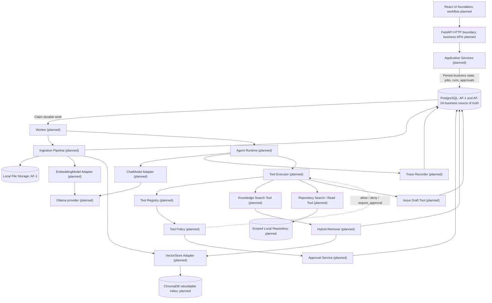
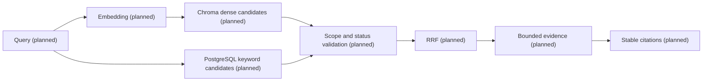

# AgentForge architecture

## Current implementation status

The Phase 3 foundation, AF-1 knowledge intake, and AF-2A ingestion persistence
foundation are implemented:

- FastAPI application factory and lifecycle;
- typed configuration;
- asynchronous PostgreSQL engine and session infrastructure;
- versioned API routing, health/readiness behavior, and unified errors;
- structured logging and request correlation;
- React/Vite application foundation;
- Docker Compose and CI foundations.
- durable `KnowledgeBase`, `Document`, and `IngestionJob` PostgreSQL records;
- secure local PDF, Markdown and text intake with streamed hashing;
- database-enforced per-knowledge-base deduplication;
- idempotent retry transitions for failed ingestion jobs;
- bounded attempt, progress, claim, lease, and retry-scheduling job metadata;
- PostgreSQL-authoritative `DocumentChunk` records with deterministic ordering.

The health and AF-1 metadata/upload/job endpoints are implemented. AF-2A does
not change those contracts and does not execute jobs or produce chunks.
Parsing, normalization, chunk creation, worker execution, embeddings, Chroma
indexing, retrieval, agent, tool, approval, trace, and evaluation capabilities
are planned and unimplemented. P1 enhancements are deferred.

## Architectural principles

- Keep a modular monolith and do not split microservices in P0.
- Keep PostgreSQL as the business source of truth.
- Treat ChromaDB as a rebuildable index.
- Maintain an explicit internal Agent Runtime boundary.
- Apply deterministic Tool Policy before every execution attempt.
- Require approval for write and external actions.
- Record a public structured trace without hidden chain-of-thought.
- Introduce adapters only with their first consumers.
- Use deterministic fake adapters for ordinary tests.
- Do not use LangGraph in P0.
- Do not use MCP in P0.

## Target module architecture

The diagram is a planned, unimplemented P0 target except for the existing React
UI foundation, FastAPI HTTP foundation, and PostgreSQL infrastructure. Arrows
show permitted dependency direction; they do not imply that every persistence
operation is strictly sequential:

Application Services persist durable work but never invoke worker processes.
The Worker claims eligible work from PostgreSQL and invokes either the planned
Ingestion Pipeline or planned Agent Runtime.

The only legal planned tool invocation path is `Agent Runtime → Tool Executor →
Tool Registry → Tool Policy`. The registry owns tool identity, version, input
schema, and risk classification. Policy returns `allow`, `deny`, or
`require_approval`. An allowed Tool Executor dispatches only the resolved
native tool through its permitted application port.

Approval decisions are persisted through the Approval Service. Approval
endpoints and the Approval Service never execute tools. After approval, the
Worker resumes the Agent Runtime, which returns through the Tool Executor. The
executor re-resolves the tool, revalidates canonical arguments, and re-runs
policy before execution.

MCP remains outside P0. Future P1 MCP tools must enter through an MCP adapter
behind the same internal Tool Registry and Tool Executor path; MCP cannot
create a second execution or policy path.

## Ingestion flow

AF-1 implements upload validation, local storage, and durable document/job
records. AF-2A adds the lease/retry fields and authoritative chunk table needed
by later stages; it does not move jobs through this flow:

```mermaid
flowchart LR
    Upload["Upload (AF-1)"] --> Validate["Validate (AF-1)"]
    Validate --> Storage["Local storage (AF-1)"]
    Storage --> Records["PostgreSQL Document + IngestionJob (AF-1)"]
    Records --> Claim["Claim with lease (AF-2C planned)"]
    Claim --> Parse["Parse (AF-2B planned)"]
    Parse --> Normalize["Normalize (AF-2B planned)"]
    Normalize --> Chunk["Deterministic chunking (AF-2B planned)"]
    Chunk --> PGChunks["DocumentChunk writes (AF-2C planned; schema AF-2A)"]
    PGChunks --> Embed["Embed (AF-2D planned)"]
    Embed --> Upsert["Chroma upsert (AF-2E planned)"]
    Upsert --> Ready["Ready (AF-2E planned)"]
```

PostgreSQL is authoritative. Chroma can be rebuilt from PostgreSQL-authoritative
records. A document is not searchable until all required persistence and index
states are complete.

### AF-2A persistence model

The four AF-1 lifecycle values remain unchanged: `pending`, `processing`,
`completed`, and `failed`. `IngestionJob` reuses its existing attempt, failure,
start, and finish fields and adds:

- `max_attempts` and `progress_percent`;
- `claimed_by`, `claimed_at`, and `lease_expires_at`;
- `next_retry_at`.

Database checks keep attempts non-negative and within a positive maximum,
progress between 0 and 100, and claimant identifiers nonblank when present.
Claim identity and timestamps must be either all absent or all present, and a
lease must expire after it is claimed. The existing status/creation index
continues to provide queue ordering; status/retry and status/lease indexes
support future scheduled-retry and expired-lease queries.

`DocumentChunk` has a stable UUID, a cascading document association, a
zero-based `chunk_index`, normalized text, a non-negative token count, and the
shared timestamps. Database constraints require non-negative ordering,
nonempty text, and uniqueness of `(document_id, chunk_index)`. That unique key
also provides document-ordered lookup without a redundant document-only index.
Embeddings and vector-store identifiers are deliberately absent.

AF-2B will consume the model boundary by adding parsers, normalization, and a
deterministic chunker. AF-2C will own worker execution, claiming, lease
renewal/recovery, retry scheduling, lifecycle transitions, and transactional
chunk replacement. AF-2D and AF-2E remain responsible for model/vector adapter
boundaries and Chroma integration respectively.

## Planned hybrid retrieval flow

This P0 flow is planned and unimplemented:

P0 has no reranker. Reranking is deferred P1 work.

## Planned Agent execution flow

This flow is planned and unimplemented:

```mermaid
flowchart LR
    Task["Task (planned)"] --> Precheck["Deterministic pre-check (planned)"]
    Precheck --> Queued["Queued Agent Run (planned)"]
    Queued --> Claim["Worker claim (planned)"]
    Claim --> Planner["Planner (planned)"]
    Planner --> Selection["Tool selection (planned)"]
    Selection --> Executor["Tool Executor (planned)"]
    Executor --> Registry["Tool Registry (planned)"]
    Registry --> Policy["Tool Policy (planned)"]
    Policy --> Dispatch{"Execute or wait for approval (planned)"}
    Dispatch --> Observation["Observation (planned)"]
    Observation --> Verifier["Verifier (planned)"]
    Verifier --> Outcome["Result, bounded retry or abstention (planned)"]
    Outcome --> Trace["Final structured trace (planned)"]
```

Limits for steps, tool calls, retrieval attempts, revisions, and wall-clock
time are explicit and testable. Numeric defaults are intentionally not assigned
until the consuming runtime feature is designed and validated.

## Tool policy and approval

The planned P0 rules are:

- the model may request a tool but cannot authorize execution;
- the registry owns tool identity, version, input schema, and risk;
- arguments are validated and canonicalized before policy evaluation;
- policy returns `allow`, `deny`, or `require_approval`;
- approval binds the exact tool version, canonical arguments digest, target
  scope, policy version, and expiry;
- changed arguments require a new approval;
- destructive P0 tools are disabled;
- approval endpoints store decisions but never execute tools directly.

P1 MCP support, if approved, enters through an adapter behind the same Tool
Registry.

## Trace and evaluation

Planned Agent Run Trace records public structured events only and never hidden
chain-of-thought. Deterministic fake adapters validate mechanics; fake results
are not product-quality metrics. Real runs produce product-quality metrics only
with recorded evidence.

Evaluation records dataset, model, prompt, retrieval, tool, and policy versions,
along with configuration digests, denominators, and environment context. P0
evaluation is planned and unimplemented.

## Dependency boundaries

| Boundary | Rule |
| --- | --- |
| Endpoints | Contain no SQL, Chroma, Ollama, or filesystem logic |
| Application services | Own use-case sequencing and transaction boundaries |
| Repositories | Own SQLAlchemy queries |
| AgentRuntime | Exposes no LangGraph types |
| Tools | Execute only through Tool Executor |
| Adapters | Keep external SDK types inside adapters |
| Frontend | Uses API contracts only |
| MCP | May later enter through an adapter behind the existing Tool Registry boundary |

These boundaries describe planned P0 work unless the current implementation
status says otherwise.

## Architecture decisions

- [ADR-001: PostgreSQL is the source of truth](adr/001-postgres-source-of-truth.md)
- [ADR-002: Use a bounded agent workflow](adr/002-bounded-agent-workflow.md)
- [ADR-003: Use PostgreSQL for the ingestion job queue](adr/003-postgres-job-queue.md)
- [ADR-004: Define the Agent Runtime boundary](adr/004-agent-runtime-boundary.md)
- [ADR-005: Enforce tool policy and approval](adr/005-tool-policy-and-approval.md)
- [ADR-006: Version configuration and use deterministic fakes](adr/006-versioned-config-and-fakes.md)
