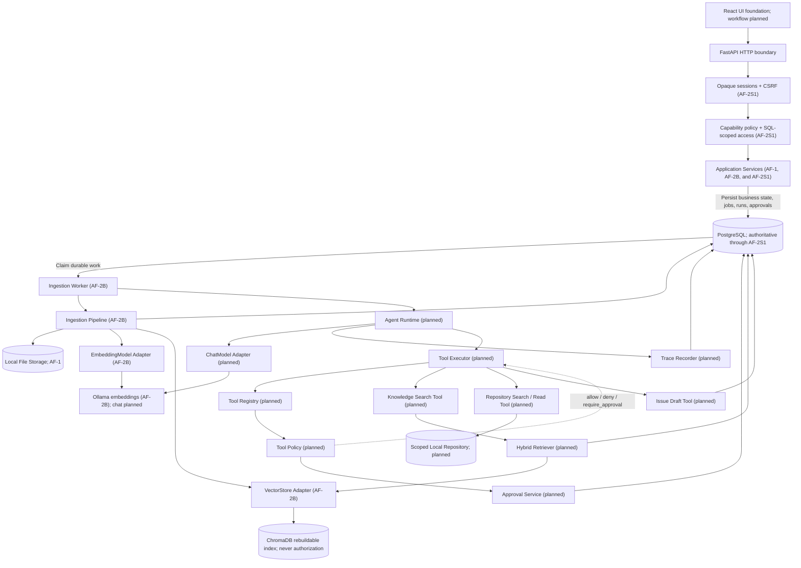
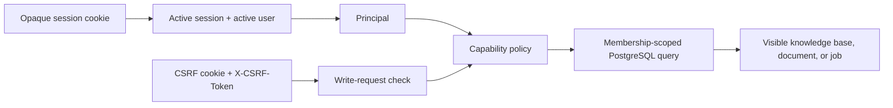
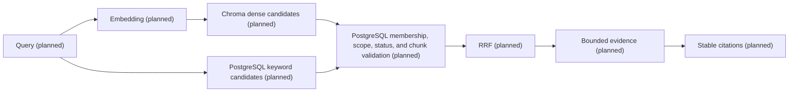

# AgentForge architecture

## Current implementation status

The Phase 3 foundation, AF-1 knowledge intake, AF-2 durable ingestion and
indexing through AF-2B, and the minimal AF-2S1 knowledge-access boundary are
implemented:

- FastAPI application factory and lifecycle;
- typed configuration;
- asynchronous PostgreSQL engine and session infrastructure;
- versioned API routing, health/readiness behavior, and unified errors;
- structured logging and request correlation;
- React/Vite application foundation;
- Docker Compose and CI foundations.
- durable `KnowledgeBase`, `Document`, and `IngestionJob` PostgreSQL records;
- secure local PDF, Markdown and text intake with streamed hashing;
- database-enforced per-knowledge-base deduplication;
- idempotent retry transitions for failed ingestion jobs;
- bounded attempt, progress, claim, lease, and retry-scheduling job metadata;
- text, Markdown, and extractable-text PDF parsers;
- deterministic normalization and overlapping chunk production;
- PostgreSQL-authoritative `DocumentChunk` records with ordering, hashes, and
  source provenance;
- short-transaction job claiming, retry scheduling, and expired-lease recovery;
- Ollama embedding and Chroma vector-store adapters behind provider-neutral
  boundaries;
- idempotent document and knowledge-base vector-index rebuilds;
- operator-provisioned local users with Argon2id password hashes;
- opaque, expiring, revocable server-side sessions with session-bound CSRF
  protection;
- owner/editor/viewer knowledge-base memberships and capability-based policy;
- principal-scoped SQL access to knowledge bases, documents, and ingestion
  jobs;
- fail-closed handling and explicit operator claiming for unowned legacy
  knowledge bases.

Health and readiness remain public. AF-2S1 adds only `login`, `logout`, and
`me` authentication endpoints; every knowledge endpoint now requires a valid
principal, and authenticated writes require CSRF proof. AF-2B adds an
out-of-process worker and rebuild commands rather than retrieval endpoints.
Retrieval, agent, tool, approval, trace, and evaluation capabilities are
planned and unimplemented. Broader AF-2S2 identity and operational hardening
is deferred to P1.

## Architectural principles

- Keep a modular monolith and do not split microservices in P0.
- Keep PostgreSQL as the business source of truth.
- Treat ChromaDB as a rebuildable index.
- Authenticate every user-facing private-data request.
- Scope object authorization in PostgreSQL queries; never authorize from
  Chroma metadata.
- Maintain an explicit internal Agent Runtime boundary.
- Apply deterministic Tool Policy before every execution attempt.
- Require approval for write and external actions.
- Record a public structured trace without hidden chain-of-thought.
- Introduce adapters only with their first consumers.
- Use deterministic fake adapters for ordinary tests.
- Do not use LangGraph in P0.
- Do not use MCP in P0.

## Target module architecture

The diagram is implemented through the AF-2S1 access boundary and AF-2B
ingestion path. Runtime, tool, retrieval, trace, and model-chat nodes remain
planned. Arrows show permitted dependency direction; they do not imply that
every persistence operation is strictly sequential:

Application Services persist durable work but never invoke worker processes.
The AF-2B Worker claims eligible ingestion work from PostgreSQL and invokes the
Ingestion Pipeline. A future worker path into the Agent Runtime remains planned.

The health endpoint bypasses the authenticated flow shown above. Worker and
operator commands use explicitly internal persistence operations; they do not
fabricate an HTTP principal or reuse user-scoped repositories.

The only legal planned tool invocation path is `Agent Runtime → Tool Executor →
Tool Registry → Tool Policy`. The registry owns tool identity, version, input
schema, and risk classification. Policy returns `allow`, `deny`, or
`require_approval`. An allowed Tool Executor dispatches only the resolved
native tool through its permitted application port.

Approval decisions are persisted through the Approval Service. Approval
endpoints and the Approval Service never execute tools. After approval, the
Worker resumes the Agent Runtime, which returns through the Tool Executor. The
executor re-resolves the tool, revalidates canonical arguments, and re-runs
policy before execution.

MCP remains outside P0. Future P1 MCP tools must enter through an MCP adapter
behind the same internal Tool Registry and Tool Executor path; MCP cannot
create a second execution or policy path.

## Ingestion flow

AF-1 implements upload validation, local storage, and durable document/job
records. AF-2A added lease/retry fields and the authoritative chunk table.
AF-2B implements the rest of this ingestion flow:

```mermaid
flowchart LR
    Upload["Upload (AF-1)"] --> Validate["Validate (AF-1)"]
    Validate --> Storage["Local storage (AF-1)"]
    Storage --> Records["PostgreSQL Document + IngestionJob (AF-1)"]
    Records --> Claim["Claim with bounded lease (AF-2B)"]
    Claim --> Parse["Parse managed artifact (AF-2B)"]
    Parse --> Normalize["Normalize deterministically (AF-2B)"]
    Normalize --> Chunk["Deterministic chunking (AF-2B)"]
    Chunk --> PGChunks["Transactional DocumentChunk replacement (AF-2B)"]
    PGChunks --> Embed["Embed in bounded batches (AF-2B)"]
    Embed --> Upsert["Idempotent Chroma upsert (AF-2B)"]
    Upsert --> Ready["Document and job completed (AF-2B)"]
```

PostgreSQL is authoritative. Chroma can be rebuilt from PostgreSQL-authoritative
records. A document and its job are not marked completed until durable chunk
persistence and derived-index updates both succeed. AF-2B does not expose
search or retrieval behavior.

### AF-2 persistence and execution model

The four AF-1 lifecycle values remain unchanged: `pending`, `processing`,
`completed`, and `failed`. `IngestionJob` reuses its existing attempt, failure,
start, and finish fields and adds:

- `max_attempts` and `progress_percent`;
- `claimed_by`, `claimed_at`, and `lease_expires_at`;
- `next_retry_at`.

Database checks keep attempts non-negative and within a positive maximum,
progress between 0 and 100, and claimant identifiers nonblank when present.
Claim identity and timestamps must be either all absent or all present, and a
lease must expire after it is claimed. The existing status/creation index
continues to provide queue ordering; status/retry and status/lease indexes
support scheduled-retry and expired-lease queries.

`DocumentChunk` has a cascading document association, a zero-based
`chunk_index`, normalized text, a non-negative token count, and the shared
timestamps. AF-2B adds a content SHA-256 plus optional character offsets and
PDF page ranges. It derives each chunk UUID deterministically from the document
UUID, chunk index, and content hash, so unchanged reprocessing preserves
identity. Database constraints require non-negative ordering, nonempty text,
valid paired provenance ranges, and uniqueness of `(document_id, chunk_index)`.
Embeddings remain outside PostgreSQL because they are regenerated data; stable
Chroma IDs derive from durable chunk UUIDs.

Workers claim due jobs with `FOR UPDATE SKIP LOCKED` in a short transaction.
Parsing, embedding calls, and Chroma writes occur without holding that
transaction open. Failures retain bounded safe error data and either schedule a
retry or become terminal when the attempt limit is reached. Expired leases are
recovered to the same bounded retry lifecycle. Cancellation is propagated
after the worker releases its claim through a short state transition.

The rebuild workflow reads ordered chunks from PostgreSQL, regenerates
embeddings in bounded batches, and idempotently replaces only the vectors for
the requested document or knowledge base. Partial external failures are
reported; durable chunk content is not rolled back or inferred from Chroma.
Knowledge-base rebuilds report and skip non-completed documents instead of
deleting vectors from a stale status snapshot that could race active ingestion.

## Knowledge-access boundary

AF-2S1 establishes the minimum P0 boundary required before private-document
retrieval:

The raw session and CSRF tokens are returned only through cookies; PostgreSQL
stores their SHA-256 digests. Passwords use Argon2id hashes and are accepted
only by the operator bootstrap command and login endpoint. There is no public
registration or authentication bypass.

Login holds no database transaction or checked-out connection during Argon2
verification or rehash computation. One application-owned bounded executor
limits that work to `ARGON2_MAX_CONCURRENCY` jobs per process (two by default).
After successful verification, a short write transaction locks the user and
rechecks active state and the observed hash before an optional rehash update
and fresh session insert.

Any active user may create a knowledge base and becomes its owner in the same
transaction. Owners and editors may read, upload, and retry; viewers may read
but cannot upload or retry. Endpoints request capabilities rather than testing
role names.

User-facing reads incorporate membership into their SQL. An absent resource
and a resource owned by a non-member both return `404`; a visible resource for
a member lacking the requested capability returns `403`. Missing or invalid
sessions return `401`, while missing or invalid CSRF proof on an authenticated
write returns `403`.

The migration does not invent owners for existing data. Unowned legacy
knowledge bases are invisible to user-facing SQL but remain available to the
internal ingestion worker. An operator can explicitly and transactionally
claim only still-unowned knowledge bases for an existing local user.

Chroma contains derived text and vectors, not authority. Future AF-3 retrieval
must scope every candidate through PostgreSQL membership, document state, and
current chunk identity before returning it. A Chroma knowledge-base ID or
other metadata value can never grant access.

## Planned hybrid retrieval flow

This P0 flow is planned and unimplemented:

P0 has no reranker. Reranking is deferred P1 work.

## Planned Agent execution flow

This flow is planned and unimplemented:

```mermaid
flowchart LR
    Task["Task (planned)"] --> Precheck["Deterministic pre-check (planned)"]
    Precheck --> Queued["Queued Agent Run (planned)"]
    Queued --> Claim["Worker claim (planned)"]
    Claim --> Planner["Planner (planned)"]
    Planner --> Selection["Tool selection (planned)"]
    Selection --> Executor["Tool Executor (planned)"]
    Executor --> Registry["Tool Registry (planned)"]
    Registry --> Policy["Tool Policy (planned)"]
    Policy --> Dispatch{"Execute or wait for approval (planned)"}
    Dispatch --> Observation["Observation (planned)"]
    Observation --> Verifier["Verifier (planned)"]
    Verifier --> Outcome["Result, bounded retry or abstention (planned)"]
    Outcome --> Trace["Final structured trace (planned)"]
```

Limits for steps, tool calls, retrieval attempts, revisions, and wall-clock
time are explicit and testable. Numeric defaults are intentionally not assigned
until the consuming runtime feature is designed and validated.

## Tool policy and approval

The planned P0 rules are:

- the model may request a tool but cannot authorize execution;
- the registry owns tool identity, version, input schema, and risk;
- arguments are validated and canonicalized before policy evaluation;
- policy returns `allow`, `deny`, or `require_approval`;
- approval binds the exact tool version, canonical arguments digest, target
  scope, policy version, and expiry;
- changed arguments require a new approval;
- destructive P0 tools are disabled;
- approval endpoints store decisions but never execute tools directly.

P1 MCP support, if approved, enters through an adapter behind the same Tool
Registry.

## Trace and evaluation

Planned Agent Run Trace records public structured events only and never hidden
chain-of-thought. Deterministic fake adapters validate mechanics; fake results
are not product-quality metrics. Real runs produce product-quality metrics only
with recorded evidence.

Evaluation records dataset, model, prompt, retrieval, tool, and policy versions,
along with configuration digests, denominators, and environment context. P0
evaluation is planned and unimplemented.

## Dependency boundaries

| Boundary | Rule |
| --- | --- |
| Endpoints | Require a Principal for private data and contain no SQL, role conditionals, Chroma, Ollama, or filesystem logic |
| Authentication | Produces a Principal from a live opaque session; SQLAlchemy models are not the public principal contract |
| Authorization | Maps capabilities to roles and preserves `401`/`403`/hidden-object `404` behavior |
| Application services | Own use-case sequencing and transaction boundaries |
| User repositories | Own principal- and capability-scoped SQLAlchemy queries |
| Worker repositories | Own explicitly internal durable-processing queries and are never used by HTTP endpoints |
| AgentRuntime | Exposes no LangGraph types |
| Tools | Execute only through Tool Executor |
| Adapters | Keep external SDK types inside adapters |
| Frontend | Uses API contracts only |
| MCP | May later enter through an adapter behind the existing Tool Registry boundary |

These boundaries describe planned P0 work unless the current implementation
status says otherwise.

## Architecture decisions

- [ADR-001: PostgreSQL is the source of truth](adr/001-postgres-source-of-truth.md)
- [ADR-002: Use a bounded agent workflow](adr/002-bounded-agent-workflow.md)
- [ADR-003: Use PostgreSQL for the ingestion job queue](adr/003-postgres-job-queue.md)
- [ADR-004: Define the Agent Runtime boundary](adr/004-agent-runtime-boundary.md)
- [ADR-005: Enforce tool policy and approval](adr/005-tool-policy-and-approval.md)
- [ADR-006: Version configuration and use deterministic fakes](adr/006-versioned-config-and-fakes.md)
- [ADR-007: Establish the knowledge-access boundary before retrieval](adr/007-knowledge-access-boundary.md)
